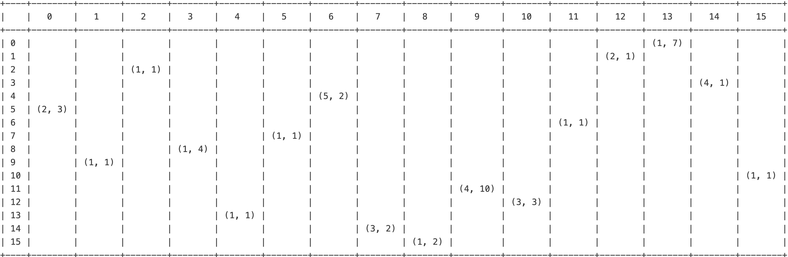
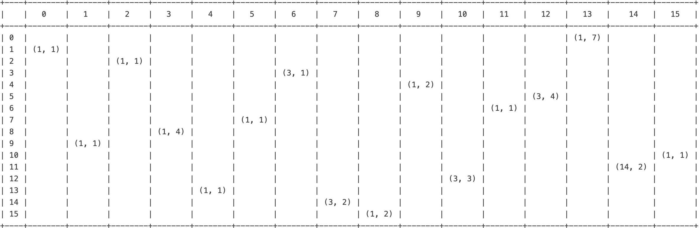
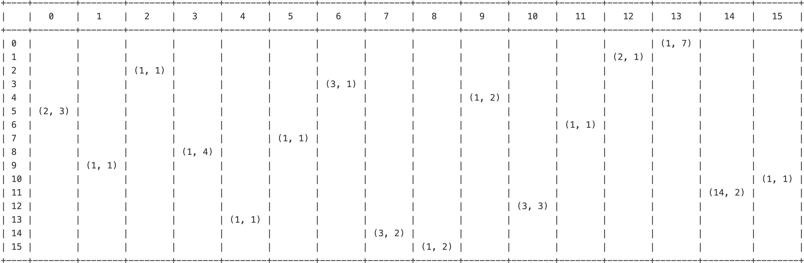
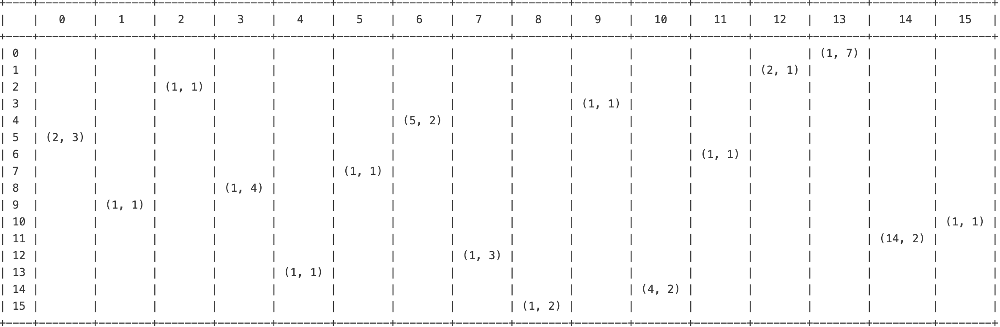

# Preference Based Allocation Problem (Stable Marriage Problem)

**Combinatorial Optimization Course Project, Dr. Farnaz Hooshmand Khaligh**  
Maryam Sadeghi, Ali Mehrabi  
Amirkabir University of Technology, Spring 2023

---

## Problem Definition
A faculty has $n$ professors and $m$ higher education student. Each professor has a specific capacity in supervising students and exactly that number of students must be allocated to them. Professors and students can both review each other's resume and on that basis, they rate each other with a number. The goal is to allocate students to professors in a way that maximizes satisfaction within the system. We formally describe the problem in the following section.

## Mathematical Modeling
We propose two different approaches in. defining satisfaction. The first approach is to model satisfaction as a mathematical function. This will provide a quantitative measure for the concept. We provide three objective functions for this approach. We then introduce a new approach for measuring satisfaction as minimizing allocations that are less preferred. We model this type of behavior as soft constraints. 

First, we will write common model components and then build on them in later sections.

### Model Summary
> ### Sets
>$\mathbb{I} = \set{1,\dots,n}$ : The set of professors.  
>$\mathbb{J} = \set{1,\dots,m}$ : The set of students.
>
>---
>
>### Parameters
>$p_{i,j} \in \set{1,\dots,m}$ *(Integer)* : The score of professor $i$ to student $j$.  
>$q_{i,j} \in \set{1,\dots,n}$ *(Integer)* : The score of student $j$ to professor $i$.  
>$Cap_i$ *(Integer)* : Research capacity of professor $i$
>
>---
>
>### Variables
>
> $$\delta_{i,j} = \begin{cases} 1 & : \text{ if professor } i \text{ and student } j \text{ work together} \\ 0 & : \text{ o.w.}\end{cases}.$$
>
>  ---
>  ### Constraints
>  1. **Research capacity constraint**: No professor shall supervise more students than their research capacity.
>
>  $$ \sum_j \delta_{i,j} \leq Cap_i \hspace{1cm} \forall i\in \mathbb{I}$$
>
>2. **Single professor per student constraint**:  Each students must be supervised by exactly one professor.  
>$$\sum_i \delta_{i,j} =1 \hspace{1cm} \forall j\in \mathbb{J}$$

---

## Objective Functions
The main point of this project is constructing a decent enough objective function that maximizes satisfaction is the system. In other words, turning "satisfaction" into a mathematical expression is what we have worked on.

### Approach 1: Explicit Definition
In this approach, the objective function itself is defined as follows and everything else will take effect within $c_{i,j}$

$$\min z = \sum_{i,j} c_{i,j}\cdot\delta_{i,j}$$

We began by defining two main aspects of allocation.
1. Total points: We would like to maximize the total points that students and professors have given to each other.
2. Difference: We would like to minimize the difference between $p_{i,j}$ and $q_{i,j}$.

With the two aspects above, we introduce the following expression.
$$c_{i,j} = {p_{i,j} + q_{i,j} + |p_{i,j} - q_{i,j}|}$$

The result is quite promising. We can observe that the model tries to choose as best pairs as possible.

The quality of allocation, based on the data, seems decent; but we decided to try a few more expressions. We first tried a concept that we call professor/student score. These are calculated as follows.

$$ S_i = {\sum_j q_{i,j} \over n} \hspace{1cm} \forall i\in \mathbb{I}$$

$$ S^\prime_j = {\sum_i p_{i,j} \over m} \hspace{1cm} \forall j\in \mathbb{J}$$

Using the above concepts, we then introduce the following expression.

$$ c_{i,j} = S_i + S^\prime_j+|S_i - S^\prime_j|+p_{i,j} + q_{i,j}+|p_{i,j} - q_{i,j}|$$

We then obtained the following results.

This was to allocate more popular students with more popular professors. Meaning, if two scores are equal in two allocations, then professor and student scores will determine the decision and the model will prioritize the more popular professor and allocate the student to them. As a result, we can see improvements in columns 1, 6 and 9, but there was also worse allocations in columns 12 and 14. However, the trade off is reasonable since pairs $(1,1), (1,2), (3,1)$ are present in the new results.

We also went further and introduced another extension to this expression. This was in order to prioritize allocations where either $p_{i,j}$ or $q_{i,j}$ are in the first 15% of their values. This will prioritize pairs such as $(1, 1), (1,2), (2,1), (2,2)$ and similar.  

$w = 1.5$  if $p_{i,j} \geq 1.15\times\max(p_{i,j})$ else 1.  
$w^\prime = 1.5$  if $q_{i,j} \geq 1.15\times\max(q_{i,j})$ else 1.

We then extended the expression in the following way.

$$  c_{i,j} = S_i + S^\prime_j+|S_i - S^\prime_j|+w\cdot p_{i,j} + w^\prime\cdot q_{i,j}+|p_{i,j} - q_{i,j}| $$

Even though the last objective function has a slight advantage over the previous one, (pair (2, 1) is an improvement but (2, 3) is a deterioration) the improvement is not significant.

### Approach 2: Satisfaction as Constraints
One way to model satisfaction is not to directly model it as means of maximizing score, but write the model in a way that minimizes worse allocations and if not successful, receive a penalty. We implemented this behavior in terms of soft constraints. We propose the following objective function along with two soft constraints to simulate this concept.

#### Objective Function
$$\min z = \sum_{i\in \mathbb{I},\;j,j^\prime \in \mathbb{J}} u_{i,j} + p_{i,j}\cdot \lambda_{i,j,j^\prime}$$
where $u_{i,j}$ and $\lambda_{i,j,j^\prime}$ are non negative integer variables. We will discuss further on their domains in the next sections.

#### Soft Constraint 1
$$\sum_{\substack{ i^\prime \neq i \\ q_{i,j} \lt q_{i^{'},j}}} \delta_{i^{'},j} = 0 \hspace{1cm} \forall i,j$$
In this constraint we ensure that for all students that are allocated to a professor (i.e. professor $i$) no other professor $i^\prime$ is allocated to the student where the student's priority on professor $i^\prime$ is better. In other words, we would like to allocate the first priority of that student to them. However, this might not be possible. (i.e. two students' first priority is the same professor) This will result in a violation of the constraint which we will penalize with $u_{i,j}$ as follows.

$$\sum_{\substack{ i^{'} \neq i\\q_{i,j} \lt q_{i^{'},j} \\}} \delta_{i^{'},j} - u_{i,j} = 0 \hspace{1cm} \forall i,j$$

Therefore, upon violation, $u_{i,j} \gt 0$. However, we know from (Constraint 2) that only one professor can be allocated to a student which means $u_{i,j} \in \set{0,1}$.

#### Soft Constraint 2
$$\delta _{i j} =1 \longrightarrow \delta_{i j^{'}}+\sum_{\substack{
i^{'} \\p_{i^{'}, j^{'} }\le p_{i, j^{'}}\\}}\delta_{i^{'} j^{'}} =1 \hspace{1cm} \forall i,j,j^\prime,p_{i j^{'} }\le p_{i j}$$

Consider $\delta_{i,j}=1$ which means student $i$ is allocated to professor $j$. This is a good allocation if all other students $j^\prime$ who were given higher priority by the professor hold in either of the following conditions:
1. The student $j^\prime$ will be allocated to the same professor. This term is crucial if we want to write a general model that works on non heterogenous attributes for the professors or the students. i.e. dynamic capacity for the professors
2. The student $j^\prime$ is allocates to another professor (i.e. professor $i^\prime$) who prioritizes student $j^\prime$ over student $j$. In other words, $p_{i^{'}, j^{'} }\le p_{i, j^{'}}$

We linearize this constraint as follows. Note that because of (Constraint 2), the right hand side of the above implication is either 0 or 1. therefore, $\delta_{i j^{'}}+\sum_{\substack{i^{'} \\p_{i^{'}, j^{'} }\le p_{i, j^{'}}\\}}\delta_{i^{'} j^{'}} \leq 1$ is trivial.

$$\delta_{i j^{'}}+\sum_{\substack{

i^{'} \\

p_{i^{'}, j^{'} }\le p_{i, j^{'}}\\

}}\delta_{i^{'} j^{'}} \ge 1-M(1-\delta _{i j}) \hspace{1cm} \forall i,j,j^\prime,p_{i j^{'} }\le p_{i j}$$

  

$$\delta_{i j^{'}}+\sum_{\substack{

i^{'} \\

p_{i^{'}, j^{'} }\le p_{i, j^{'}}\\

}}\delta_{i^{'} j^{'}} \ge \delta _{i j} \hspace{1cm} \forall i,j,j^\prime,p_{i j^{'} }\le p_{i j}$$

We then penalize its violation by adding an integer variable to the left hand side of the constraint. Like (Soft Constraint 1), we can conduct that $\lambda_{i,j,j^\prime}\in \set{0,1}$

$$\delta_{i j^{'}}+\sum_{\substack{
i^{'} \\
p_{i^{'}, j^{'} }\le p_{i, j^{'}}\\
}}\delta_{i^{'} j^{'}} + \lambda_{i,j,j^{'}} \ge \delta _{i j} \hspace{1cm} \forall i,j,j^\prime,p_{i j^{'} }\le p_{i j}$$

Using the proposed model, we obtain the following results. As we can see this approach achieves some improvement over the previous one. It can be seen that the number of (1,1) pairs has increased at the cost of the increase of some worse pair allocations.

---

## Conclusion and Future Work
Satisfaction as a qualitative concept can be quantized using many techniques. We propose several approaches to this and compared the performance and accuracy of the models. As a result, we noticed that defining satisfaction in terms of constraint violation rate will result in better allocation quality on the sample data.
We plan on further improving this project by modeling the problem as a multi-objective problem where we will find a feasible solution and solve upon that.
